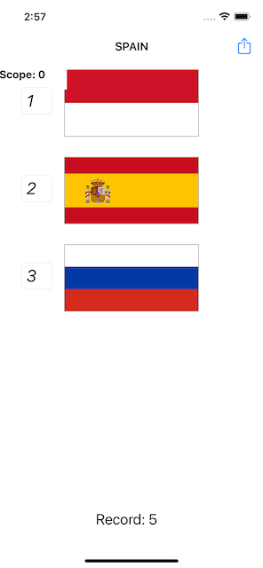

# Проект 2 - Угадай флаг

https://www.hackingwithswift.com/100/19

Включает решения [проблем] (https://www.hackingwithswift.com/read/2/6/wrap-up).

## Темы

UIButton, CALayer, IBAction

## Проблемы

Из [Взлом с помощью Swift] (https://www.hackingwithswift.com/read/2/6/wrap-up):
> 1. Попробуйте показать счет игрока на панели навигации рядом с флажком, чтобы угадать.
> 2. Следите за тем, сколько вопросов было задано, и покажите одно последнее предупреждение после того, как они ответят 10. Это должно показать их окончательный результат.
> 3. Когда кто-то выбирает неправильный флаг, сообщите ему об их ошибке в своем предупреждающем сообщении - что-то вроде «Неправильно! Это, например, флаг Франции ».

## Скриншоты 

