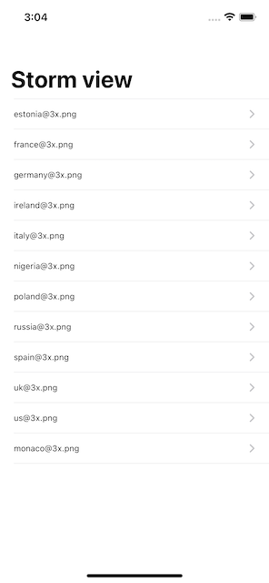
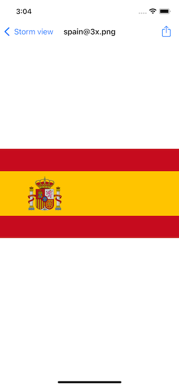

# Проект 3 - Социальные сети

https://www.hackingwithswift.com/100/22

Включает решения [проблем] (https://www.hackingwithswift.com/read/3/3/wrap-up).

## Темы

UIBarButtonItem, UIActivityController

## Вызов

Из [Взлом с помощью Swift] (https://www.hackingwithswift.com/read/3/3/wrap-up):
> 1. Попробуйте добавить имя изображения в список элементов, которыми вы поделились. Параметр activityItems представляет собой массив, поэтому вы можете свободно добавлять строки и другие элементы. Примечание. Facebook не позволит вам обмениваться текстом, но большинство других опций обмена позволяют.
> 2. [Challenge 2] (Challenge2 /)
> 3. [Challenge 3] (Challenge3 /)

## Скриншоты

