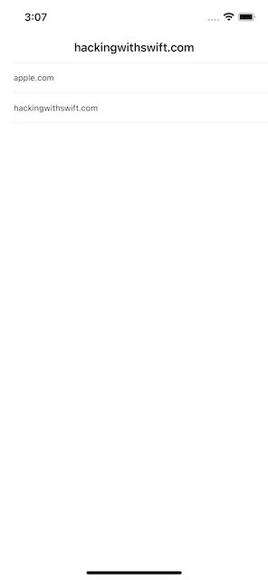
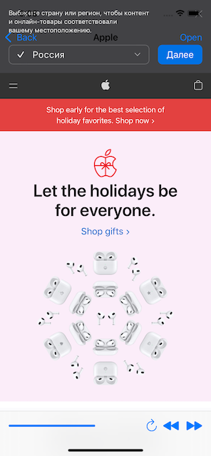

# Проект 4 - Простой браузер

https://www.hackingwithswift.com/100/24

Включает решения [проблем] (https://www.hackingwithswift.com/read/4/6/wrap-up).

## Темы

WKWebView, листы действий, UIToolbar, UIProgressView

## Проблемы

Из [Взлом с помощью Swift] (https://www.hackingwithswift.com/read/4/6/wrap-up):
> 1. Если пользователи попытаются перейти по запрещенному URL, покажите предупреждение о том, что он заблокирован.
> 2. Попробуйте создать два новых элемента панели инструментов с заголовками «Назад» и «Вперед». Вы должны заставить их использовать webView.goBack и webView.goForward.
> 3. Для большей сложности попробуйте изменить начальный контроллер представления на табличное представление, как в проекте 1, где пользователи могут выбирать свой веб-сайт из списка, а не просто загружать первый в массиве заранее.

## Скриншоты

