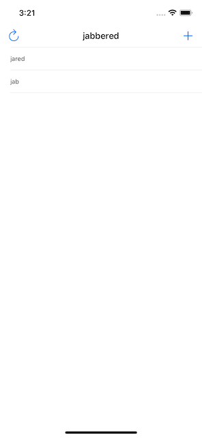

# Проект 5 - Битва слов

https://www.hackingwithswift.com/100/27

Включает решения [проблем] (https://www.hackingwithswift.com/read/5/7/wrap-up).

## Темы

Чтение с диска, UIAlertController, IndexPath

## Проблемы

Из [Взлом с помощью Swift] (https://www.hackingwithswift.com/read/5/7/wrap-up):
> 1. Запрещайте ответы, которые короче трех букв или являются просто начальным словом. Для трехбуквенной проверки проще всего сделать проверку в isReal (), которая вернет false, если длина слова меньше трех букв. Для второй части просто сравните начальное слово с их входным словом и верните false, если они совпадают.
> 2. Выполните рефакторинг всех операторов else, которые мы только что добавили, чтобы они вызывали новый метод с именем showErrorMessage (). Это должно принять сообщение об ошибке и заголовок, и оттуда будет выполняться вся работа UIAlertController.
> 3. Добавьте кнопку левой панели, которая вызывает startGame (), чтобы пользователи могли перезапустить игру с новым словом, когда захотят.
>
> Бонус: после того, как вы сделаете эти три, в нашей игре появится действительно незаметная ошибка, и я хотел бы, чтобы вы попытались найти и исправить ее.
>
> Чтобы вызвать ошибку, найдите слово из трех букв в начальном слове и введите его с заглавной буквы. Как только он появится в таблице, попробуйте ввести его снова в нижнем регистре - вы увидите, что он введен. Можете ли вы выяснить, что вызывает это и как это исправить?

## Скриншоты

