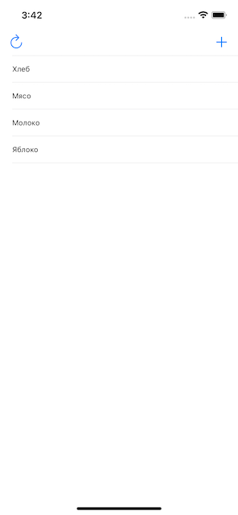

 # Проекты 4-6 - Список покупок

https://www.hackingwithswift.com/100/32

Бонус:
- проверить, присутствует ли уже элемент
- проведите пальцем, чтобы удалить элемент

## Вызов

Из [Взлом с помощью Swift] (https://www.hackingwithswift.com/guide/3/3/challenge):
> Пришло время проверить свои навыки, создав собственное полное приложение с нуля. На этот раз ваша задача - создать приложение, которое позволит людям создавать списки покупок, добавляя элементы в представление таблицы.
>
> Лучший способ справиться с этим приложением - подумать о том, как вы создаете проект 5: это было табличное представление, в котором отображались элементы из массива, и мы использовали UIAlertController с текстовым полем, чтобы пользователи могли вводить произвольный текст, добавленный к множество. Это составляет основу этого приложения, за исключением того, что на этот раз вам не нужно проверять добавляемые элементы - если пользователи вводят какой-то текст, предположите, что это настоящий продукт, и добавьте его в свой список.
>
> Для получения бонусных баллов добавьте кнопку левой панели, которая очищает список покупок - какой метод следует использовать после этого, чтобы заставить представление таблицы перезагружать все свои данные?
>
> Вот несколько советов на случай, если у вас возникнут проблемы:
>
> - Не забудьте изменить ViewController, чтобы он основывался на UITableViewController, а затем измените раскадровку, чтобы она соответствовала.
> - Создайте свойство shoppingList типа [String] для хранения всех товаров, которые пользователь хочет купить.
> - Создайте свой UIAlertController со стилем .alert, затем вызовите addTextField (), чтобы пользователь мог ввести текст.
> - Когда у вас есть новый элемент списка покупок, убедитесь, что вы вставили его () в свой массив shoppingList, прежде чем вызывать метод insertRows (at :) представления таблицы - ваше приложение выйдет из строя, если вы сделаете это неправильно.
>
> У вас может возникнуть соблазн попробовать использовать UIActivityViewController для отправки готового списка покупок по электронной почте, но если вы это сделаете, вы столкнетесь с проблемой: у вас есть массив строк, а не одна строка.
>
> Существует специальный метод, с помощью которого можно создать одну строку из массива, сшивая каждую часть вместе с помощью предоставленного вами разделителя. Я займусь этим в проекте 8, но если вы хотите попробовать это сейчас, вот вам код для начала:
>
> `` быстрый
> пусть список = shoppingList.joined (разделитель: "\ n")
> ``
>
> Это создаст новую константу списка, которая представляет собой обычную строку, в которой каждый элемент списка покупок разделен символом «\ n» - это способ представления новой строки в Swift.

## Скриншоты

