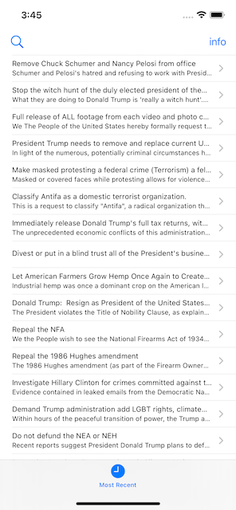
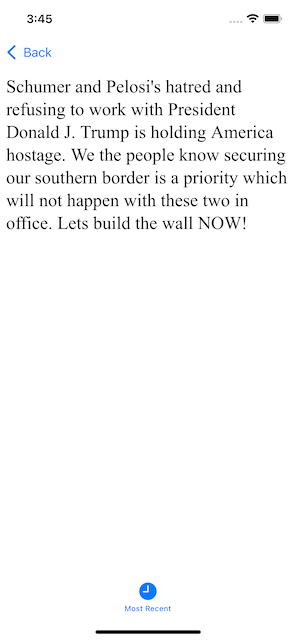

# Проект 7 - Петиции в Белый дом

https://www.hackingwithswift.com/100/33

Включает решения [проблем] (https://www.hackingwithswift.com/read/7/6/wrap-up).

Бонус:
- фильтрация по сути дела
- отображать текущий фильтр в панели навигации
- сброс фильтра

## Темы

UITabBarController, JSON, Данные, Кодируемый

## Проблемы

Из [Взлом с помощью Swift] (https://www.hackingwithswift.com/read/7/6/wrap-up):
> 1. Добавьте кнопку «Кредиты» в верхний правый угол с помощью UIBarButtonItem. При нажатии на него отображается предупреждение, сообщающее пользователям, что данные поступают из We The People API Белого дома.
> 2. Позвольте пользователям фильтровать петиции, которые они видят. Это включает в себя создание второго массива отфильтрованных элементов, который содержит только петиции, соответствующие строке, введенной пользователем. Используйте UIAlertController с текстовым полем, чтобы позволить им ввести эту строку. Это сложный вопрос, поэтому я привел несколько советов ниже, если вы застрянете.
> 3. Поэкспериментируйте с HTML - это не учебник по HTML или CSS, но вы можете найти множество ресурсов в Интернете, которые дадут вам достаточно знаний, чтобы немного поработать с макетом.

## Скриншоты

