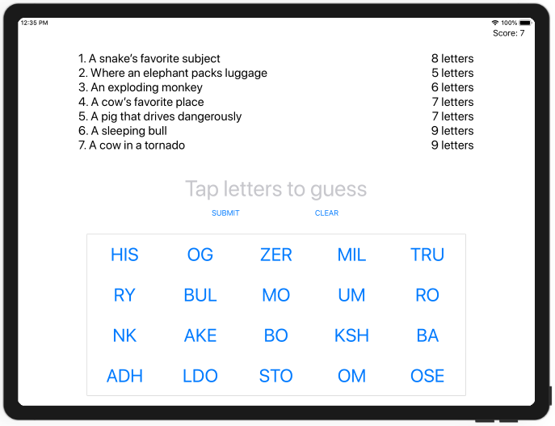

# Проект 8 - 7 быстрых слов

https://www.hackingwithswift.com/100/36

Включает решения [проблем] (https://www.hackingwithswift.com/read/8/6/wrap-up).

Бонус:
- Вернитесь на уровень 1 после прохождения всех уровней

## Темы

Пользовательский интерфейс в коде, выравнивание текста, поля макета, UIFont

## Проблемы

Из [Взлом с помощью Swift] (https://www.hackingwithswift.com/read/8/6/wrap-up):
> 1. Используйте методы, которые вы изучили в проекте 2, чтобы нарисовать тонкую серую линию вокруг панели кнопок, чтобы выделить ее среди остального пользовательского интерфейса.
> 2. Если пользователь вводит неверное предположение, покажите ему предупреждение, сообщающее, что он ошибается. Вам нужно будет расширить метод submitTapped (), чтобы, если firstIndex (of :) не смог найти предположение, вы показывали предупреждение.
> 3. Попробуйте сделать так, чтобы игра также вычитала очки, если игрок делает неверное предположение. Подумайте, как вы можете перейти на следующий уровень - мы больше не можем использовать простой остаток от деления для счета игрока, потому что он мог потерять несколько очков.

## Скриншоты

