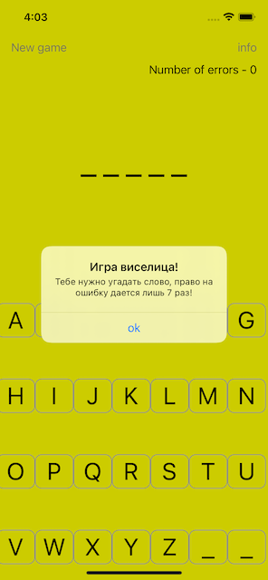

# Проекты 7-9 - Палач

https://www.hackingwithswift.com/100/41

Список слов благодаря [Wiktionary] (https://en.wiktionary.org/)

## Вызов

Из [Взлом с помощью Swift] (https://www.hackingwithswift.com/guide/4/3/challenge):
> Это первая задача, которая требует от вас создания игры. Тем не менее, вы по-прежнему будете использовать UIKit, так что это хороший шанс попрактиковаться в работе с приложениями.
>
> Задача такова: сделать игру с палачом с помощью UIKit. Напоминаем, что это означает выбор случайного слова из списка возможных, но представление его пользователю в виде ряда подчеркиваний. Итак, если ваше слово было «RHYTHM», пользователь увидел бы «??????».
>
> Затем пользователь может угадывать буквы по одной: если он угадывает букву, которая есть в слове, например H, выясняется, что он делает «? H ?? H?»; если они угадывают неправильную букву, они на дюйм ближе к смерти. Если они семь неправильных ответов, они проигрывают, но если им удастся перед этим произнести слово полностью, они выиграют.
>
> Вот и игра: сможешь ли ты это сделать? Не стоит недооценивать это: это вызов не зря - он должен вас растягивать!
>
> Основная сложность, с которой вы столкнетесь, заключается в том, что в Swift есть специальный тип данных для отдельных букв, называемый символом. Создавать строки из символов и наоборот легко, но нужно знать, как это делается.
>
> Во-первых, отдельные буквы строки доступны, просто рассматривая строку как массив - это немного похоже на массив объектов Character, которые вы можете перебирать или читать его свойство count, как обычные массивы.
>
> Когда вы пишете букву в слово, буквенная константа будет иметь тип Character, поэтому, если ваш массив usedLetters содержит строки, вам нужно будет преобразовать эту букву в строку, например:
>
> `` быстрый
> пусть strLetter = String (буква)
> `` `
>
> Примечание: в отличие от обычных массивов, вы не можете читать буквы в строках, просто используя их целые позиции - они хранят каждую букву сложным образом, что запрещает такое поведение.
>
> Если у вас есть строковая форма каждой буквы, вы можете использовать contains (), чтобы проверить, находится ли она внутри вашего массива usedLetters.
>
> Этого достаточно, чтобы самому справиться с этой задачей. Как обычно, ниже есть несколько советов, но всегда полезно попробовать их самостоятельно, прежде чем читать их.
>
> - Вы уже знаете, как загрузить список слов с диска и выбрать одно, потому что это именно то, что мы сделали в уроке 5.
> - Вы знаете, как предлагать пользователю ввести текст, опять же, потому что это было в учебнике 5. Очевидно, что на этот раз вы должны принимать только отдельные буквы, а не целые слова - используйте для этого someString.count.
> - Вы можете отобразить текущее слово и оценку пользователя, используя свойство title вашего контроллера представления.
> - Вы должны создать массив usedLetters, а также целое число invalidAnswers.
> - Когда игрок выигрывает или проигрывает, используйте UIAlertController, чтобы показать предупреждение с сообщением.

## Скриншоты

