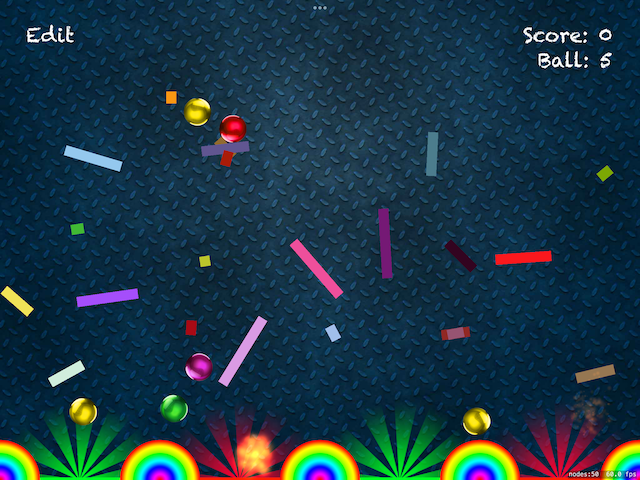

# Проект 11 - Пачинко

https://www.hackingwithswift.com/100/45

Включает решения [проблем] (https://www.hackingwithswift.com/read/11/8/wrap-up).

## Темы

SpriteKit, узлы, UITouch, Physics Body, SKAction, Collisions, Emitters

## Проблемы

Из [Взлом с помощью Swift] (https://www.hackingwithswift.com/read/11/8/wrap-up):
> 1. На изображениях, которые мы используем, есть другие изображения мячей, а не просто "ballRed". Попробуйте написать код, чтобы использовать случайный цвет шариков каждый раз, когда они касаются экрана.
> 2. Прямо сейчас пользователи могут нажать в любом месте, чтобы создать мяч, что делает игру слишком простой. Попробуйте установить значение Y для новых шаров так, чтобы они находились в верхней части экрана.
> 3. Дайте игрокам ограничение в пять мячей, а затем убирайте ящики с препятствиями, когда в них попадают. Могут ли они очистить все кегли всего пятью шарами? Вы можете сделать так, чтобы приземление на зеленую ячейку давало им дополнительный мяч.

## Скриншоты

