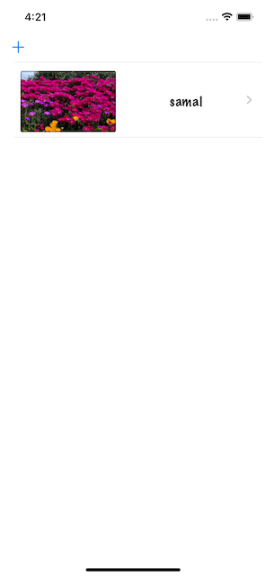

# Projects 10-12 - Подписи к фотографиям

https://www.hackingwithswift.com/100/50

## Вызов

Из [Взлом с помощью Swift] (https://www.hackingwithswift.com/guide/5/3/challenge):
> Ваша задача - объединить два разных проекта в один: я бы хотел, чтобы вы разрешили пользователям фотографировать то, что им интересно, добавлять к ним подписи, а затем показывать эти фотографии в виде таблицы. Нажатие на заголовок должно отображать изображение в новом контроллере представления, как мы это делали с проектом 1. Итак, ваш готовый проект должен использовать элементы как из проекта 1, так и из проекта 12, что должно дать вам достаточно возможностей для практики.
>
> Для этого потребуется использовать параметр picker.sourceType = .camera для контроллера выбора изображений, создать пользовательский тип, в котором хранятся имя файла и заголовок, а затем отобразить список сохраненных изображений в виде таблицы. Помните: использование камеры возможно только на физическом устройстве.
>
> Это может показаться нелогичным, но поверьте мне: один из лучших способов глубоко изучить вещи - это выучить их, забыть, а затем выучить снова. Так что не беспокойтесь, если есть некоторые вещи, которые вы не сразу вспомните: напрягите свой мозг или, возможно, перечитайте старую главу, просто ненадолго, - это отличный способ немного помочь вашим знаниям iOS. более.
>
> Вот несколько советов на случай, если у вас возникнут проблемы:
>
> - Вам нужно будет создать ViewController на основе UITableViewController, а не только на UIViewController.
> - Как и в проекте 10, вы должны создать собственный тип, который хранит имя файла изображения и строку заголовка, а затем использовать Codable или NSCoding для его загрузки и сохранения.
> - Используйте UIAlertController, чтобы получить подпись пользователя к своему изображению - достаточно одного текстового поля.
> - Вам нужно будет спроектировать контроллер подробного представления с помощью Interface Builder, а затем вызвать instantiateViewController, чтобы загрузить его при касании строки представления таблицы.

#Screenshots

