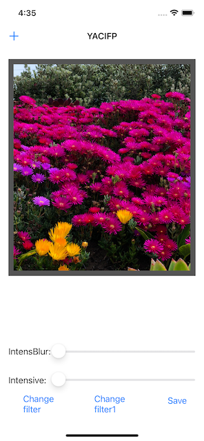

# Проект 13 - Instafilter

https://www.hackingwithswift.com/100/52

Включает решения [проблем] (https://www.hackingwithswift.com/read/13/6/wrap-up).

## Темы

UISlider, UIImagePickerController, CIContext, CIFilter, Сохранение фотографий

## Проблемы

Из [Взлом с помощью Swift] (https://www.hackingwithswift.com/read/13/6/wrap-up):
> 1. Попробуйте сделать так, чтобы кнопка «Сохранить» показывала ошибку, если в просмотре изображений не было изображения.
> 2. Заставьте кнопку «Изменить фильтр» изменить заголовок, чтобы отобразить имя текущего выбранного фильтра.
> 3. Поэкспериментируйте с более чем одним ползунком, чтобы управлять каждой из клавиш ввода, которые вам нужны. Например, у вас может быть один для радиуса и один для интенсивности.

## Скриншоты

