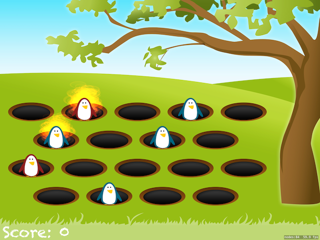

# Проект 14 - Ударь пингвина

https://www.hackingwithswift.com/100/55

Включает решения [проблем] (https://www.hackingwithswift.com/read/14/5/wrap-up).

## Темы

SKCropNode, SKTexture, SKAction

## Проблемы

Из [Взлом с помощью Swift] (https://www.hackingwithswift.com/read/14/5/wrap-up):
> 1. Запишите свой голос, сказав «Игра окончена!» и пусть он поиграет, когда игра закончится.
> 2. При отображении «Игра окончена» добавьте SKLabelNode, показывающий их окончательный результат.
> 3. Используйте SKEmitterNode для создания эффекта дыма при ударе пингвинов и отдельного эффекта грязи, когда они входят в яму или выходят из нее.

## Скриншоты

