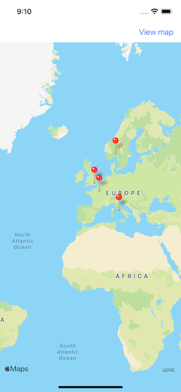
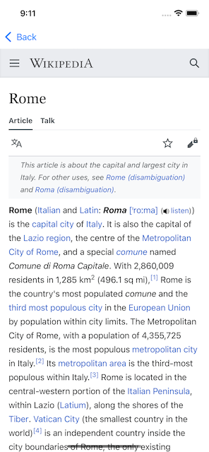

# Проект 16 - Столицы

https://www.hackingwithswift.com/100/60

Включает решения [проблем] (https://www.hackingwithswift.com/read/16/4/wrap-up).

## Темы

MapKit, MKMapView, MKAnnotation, CLLocationCoordinate2D

## Проблемы

Из [Взлом с помощью Swift] (https://www.hackingwithswift.com/read/16/4/wrap-up):
> 1. Попробуйте привести тип возвращаемого значения из dequeueReusableAnnotationView (), чтобы оно было MKPinAnnotationView. Как только это будет сделано, измените свойство pinTintColor на свой любимый UIColor.
> 2. Добавьте UIAlertController, который позволяет пользователям указывать, как они хотят просматривать карту. Есть свойство mapType, которое рисует карты по-разному. Например, .s Satellite отображает местность со спутника.
> 3. Измените кнопку выноски так, чтобы при ее нажатии отображался новый контроллер представления с веб-представлением, переводя пользователей к записи в Википедии для этого города.

## Скриншоты

