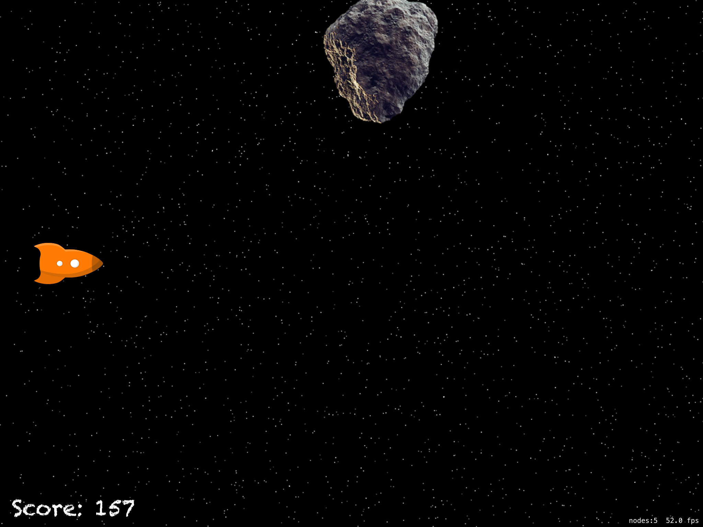
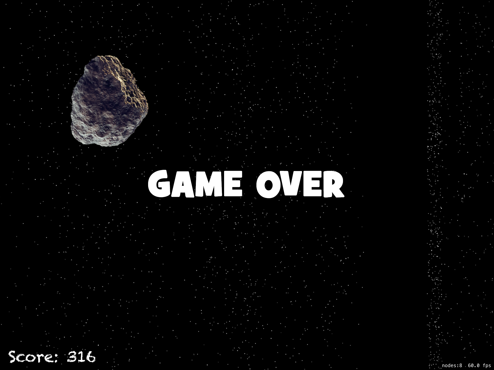

# Проект 17 - Космическая гонка

https://www.hackingwithswift.com/100/62

Включает решения [проблем] (https://www.hackingwithswift.com/read/17/5/wrap-up).

## Темы

Столкновения, Таймер

## Проблемы

Из [Взлом с помощью Swift] (https://www.hackingwithswift.com/read/17/5/wrap-up):
> 1. Остановите игрока от жульничества, подняв палец и нажав где-нибудь в другом месте - попробуйте реализовать touchesEnded (), чтобы заставить его работать.
> 2. Включите таймер на одну секунду, но затем, после того, как 20 врагов будут убиты, вычтите из него 0,1 секунды, чтобы он срабатывал каждые 0,9 секунды. Сделав еще 20, вычтите еще 0,1 и так далее. Примечание: вы должны вызвать invalidate () для gameTimer перед тем, как присвоить ему новое значение, иначе вы получите несколько таймеров.
> 3. Прекратите создавать космический мусор после смерти игрока.

## Скриншоты

