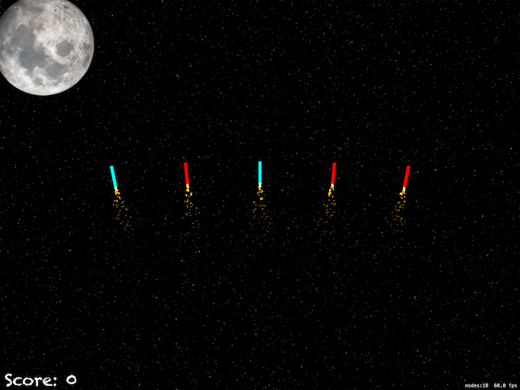

#Проект 20 - Ночь фейерверков

https://www.hackingwithswift.com/100/70

Включает решения [проблем] (https://www.hackingwithswift.com/read/20/5/wrap-up).

## Темы

UIBezierPath, SKAction follow, узлы-emmiter

## Проблемы

Из [Взлом с помощью Swift] (https://www.hackingwithswift.com/read/20/5/wrap-up):
> 1. Чтобы упростить задачу, попробуйте добавить метку счета, которая обновляется по мере изменения счета игрока.
> 2. Завершить игру после определенного количества запусков. Вам нужно будет использовать метод invalidate () таймера, чтобы остановить его повторение.
> 3. Используйте действия waitForDuration и removeFromParent в последовательности, чтобы убедиться, что эмиттеры частиц взрыва удалены из сцены игры после их завершения.
## Скриншоты

