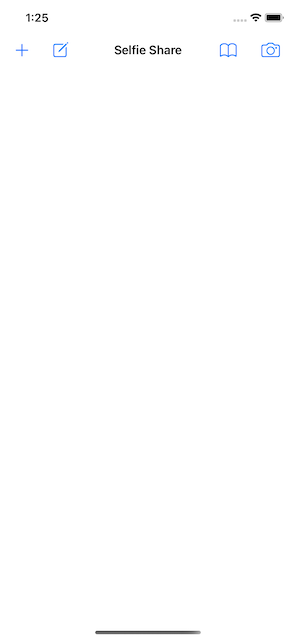
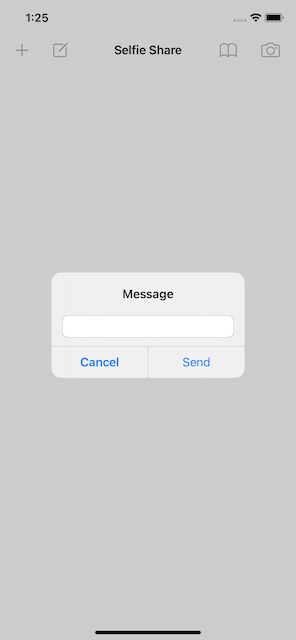
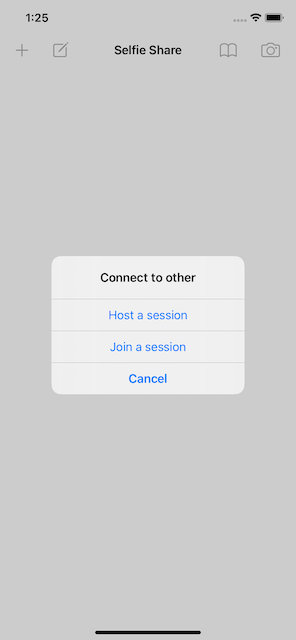
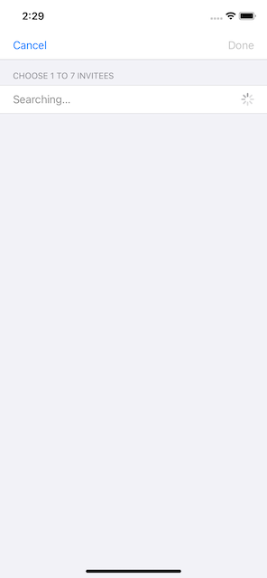
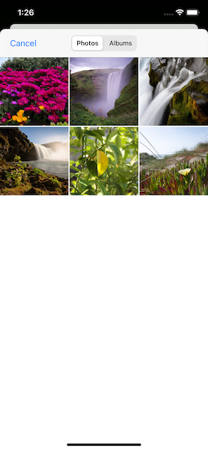

# Проект 25 - Поделиться селфи

https://www.hackingwithswift.com/100/83

Включает решения [проблем] (https://www.hackingwithswift.com/read/25/5/wrap-up).

## Темы

Одноранговая сеть, MCSession, MCBrowserViewController, MCPeerID

## Проблемы

Из [Взлом с помощью Swift] (https://www.hackingwithswift.com/read/25/5/wrap-up):
> 1. Показывать предупреждение, когда пользователь отключился от нашей многопользовательской сети. Достаточно чего-нибудь вроде «iPhone Пола отключился».
> 2. Попробуйте отправлять текстовые сообщения по сети. Вы можете создать Data из строки с помощью Data (yourString.utf8) и преобразовать Data обратно в строку с помощью String (декодирование: yourData, как: UTF8.self).
> 3. Добавьте кнопку, которая показывает контроллер предупреждений, в котором перечислены имена всех устройств, подключенных в данный момент к сеансу - используйте свойство connectedPeers вашего сеанса, чтобы найти эту информацию.
## Скриншоты

