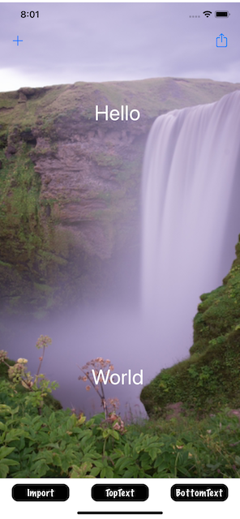

# Знаковые проекты 25-27 - Генератор мемов

https://www.hackingwithswift.com/100/90

## Вызов

От [Взлома с помощью Swift](https://www.hackingwithswift.com/guide/10/3/challenge ):
>Ваша задача на этом этапе - создать приложение для создания мемов с использованием UIImagePickerController, UIAlertController и Core Graphics. Если вы с ними не знакомы, мемы - это простой формат, который показывает картинку с одной строкой текста, наложенной сверху, и другой, наложенной снизу.
>
> Ваше приложение должно:
>
>- Предложите пользователю импортировать фотографию из своей библиотеки фотографий.
>- Показать предупреждение с текстовым полем с просьбой вставить строку текста в начало мема.
>- Показать второе предупреждение для нижней части мема.
>- Визуализируйте их изображение плюс оба фрагмента текста в одно готовое изображение пользовательского интерфейса с использованием базовой графики.
>- Пусть они поделятся этим результатом с помощью UIActivityViewController.
>
> Как верхняя, так и нижняя части текста должны быть необязательными; пользователю не нужно их указывать, если он этого не хочет.
>
> Попробуйте решить эту задачу прямо сейчас. Как обычно, ниже приведены некоторые подсказки на случай, если у вас возникнут проблемы.
>
>1. Ваш пользовательский интерфейс может быть довольно простым: большой вид изображения с тремя кнопками ниже: Импортировать изображение, Установить верхний текст и Установить нижний текст.
>2. Оба фрагмента текста можно прочитать с помощью UIAlertController с текстовым полем внутри.
>3. При рендеринге готового изображения убедитесь, что вы сначала нарисовали свое изображение UI, а затем добавили текст сверху.
>4. В NSAttributedString есть ключи для указания ширины обводки и цвета текста, что сделает его более читабельным – можете ли вы поэкспериментировать, чтобы понять это?

## Скриншоты

