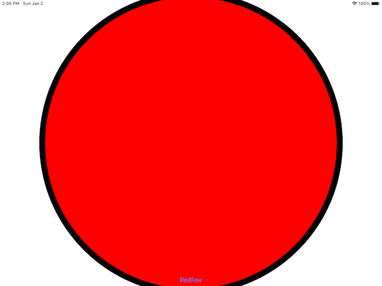

# Проект 27 - Ядерная графика

https://www.hackingwithswift.com/100/88

Включает решения [проблем](https://www.hackingwithswift.com/read/27/7/wrap-up ).

## Темы

Основная графика, Средство визуализации графических изображений пользовательского интерфейса, Заливки и штрихи, Преобразования

## Скриншоты

